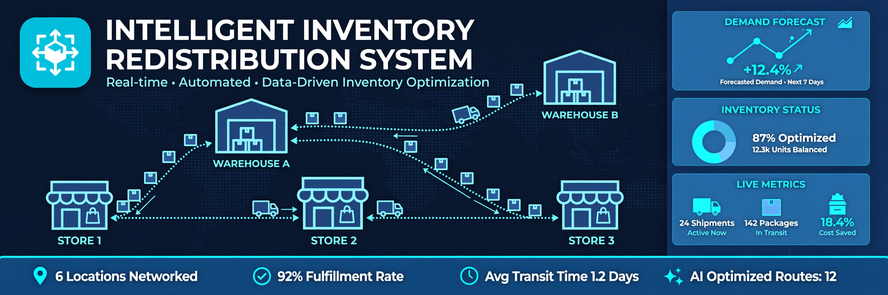

# StockFlow — Intelligent Inventory Redistribution System

> ## Status: 🟢 Completed
>
> <progress value="90" max="100"></progress>
>
> **Progress: 90%** — Complete simulation with documented algorithms. Pure Java, no dependencies.

<p align="center">
  
</p>


## What it is

StockFlow is a pure-Java desktop simulation of a multi-warehouse, multi-store retail supply chain. It models warehouses, stores, trucks, and customer demand — then runs an intelligent redistribution engine that decides what to ship, from where, and when, to prevent stockouts. Built with Swing + AWT + multithreading. Zero external libraries, no JavaFX, no databases.

See [ALGORITHM.md](ALGORITHM.md) for the full write-up on the redistribution engine, complexity analysis, and scaling.

## What works (verified)

- ✅ **Simulation engine** — multi-threaded: `SimulationEngine`, `RedistributionEngine`, `OptimizationEngine` run as separate threads
- ✅ **Demand modeling** — `DemandModel` + `DemandGenerator` produce realistic per-store demand signals
- ✅ **Redistribution logic** — scores every (store, product, warehouse) triple on cost, distance, lead time
- ✅ **Transport simulation** — `TransportationSimulator` moves trucks between locations
- ✅ **Dashboard UI** — Swing interface with map panel, inventory tables, transfer tables, line charts, metrics
- ✅ **Thread safety** — UI never mutates model state; engine owns threads, UI reads snapshots on EDT
- ✅ **Zero dependencies** — compiles with just `javac`, no Maven/Gradle needed

## Tech stack

| Layer | Technology |
|-------|-----------|
| Language | Java (Swing + AWT) |
| Concurrency | Java threads, EDT-safe UI |
| Data | In-memory collections |
| Dependencies | None |

## How to run

```bash
cd StockFlow
javac -d out $(find src -name '*.java')
java -cp out com.stockflow.App
```

> Requires a JDK (8+). No build tools or external libraries needed.

## What you can add more

- [ ] **Real geographic data** — replace euclidean map units with actual distances
- [ ] **Persistent storage** — save/load simulation state (currently in-memory only)
- [ ] **More demand patterns** — seasonal trends, promotions, flash sales
- [ ] **Cost optimization UI** — let users tune the scoring weights visually
- [ ] **Export reports** — CSV/PDF export of metrics and transfer history
- [ ] **Headless mode** — run simulations without UI for batch experiments
- [ ] **Web dashboard** — replace Swing with a web frontend for accessibility

## Project structure

```
StockFlow/src/com/stockflow/
├── App.java          # Entry point
├── models/           # Product, Inventory, Warehouse, Store, Truck, Transfer, CustomerOrder
├── core/             # World, InventoryIndex, LocationMap, DemandModel, MetricsManager
├── engine/           # SimulationEngine, RedistributionEngine, OptimizationEngine,
│                     # OrderGenerator, DemandGenerator, TransportationSimulator
└── ui/               # DashboardFrame, MapPanel, InventoryTable, TransferTable,
                      # LineChart, MetricsPanel, EventLogPanel
```

---
*README written after code audit on 2026-10-08.*
